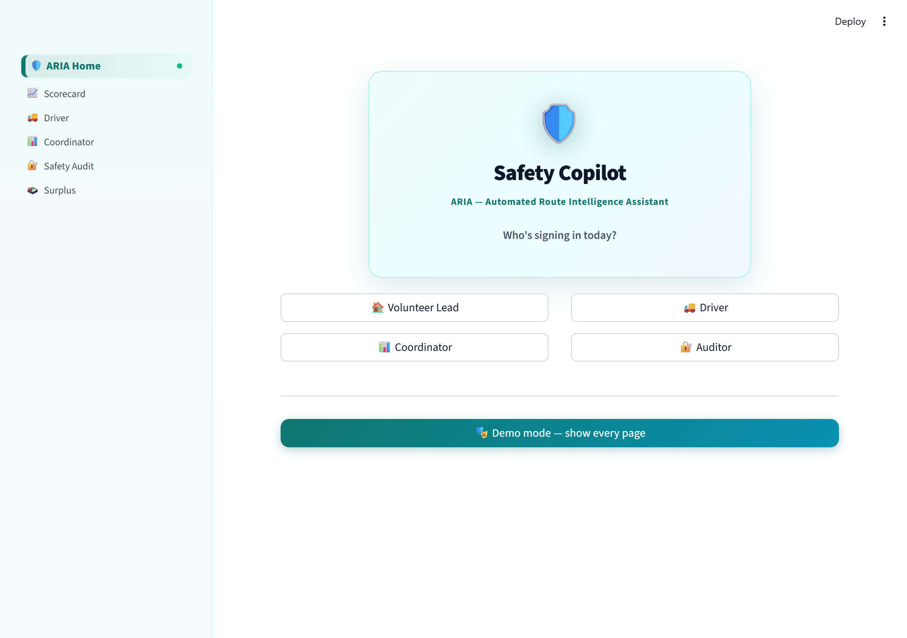
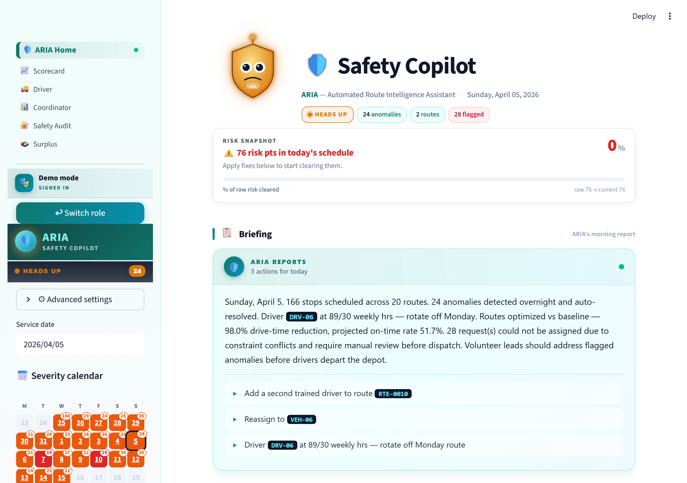
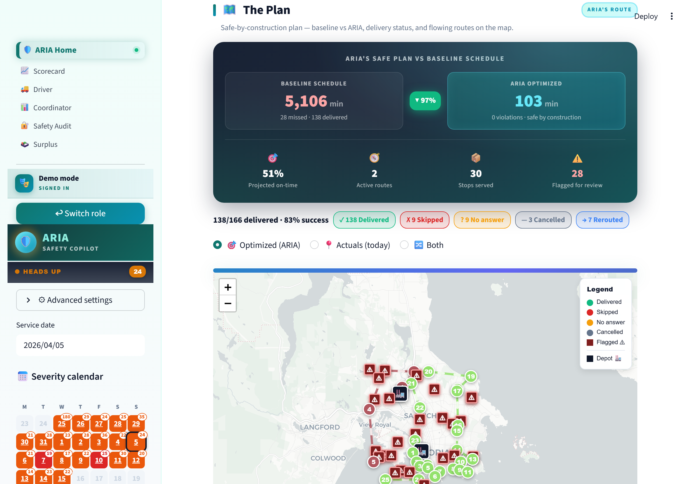
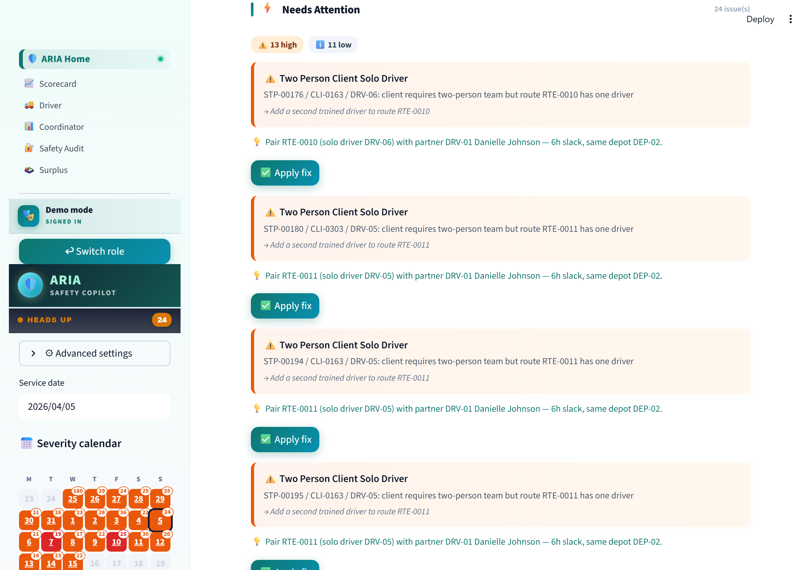
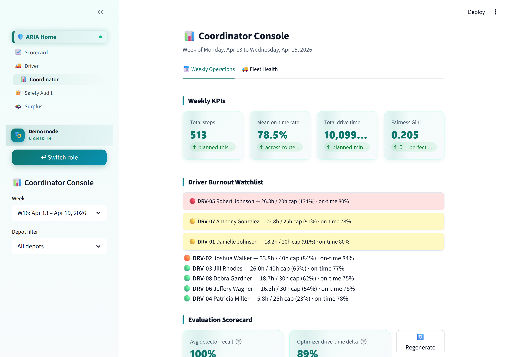
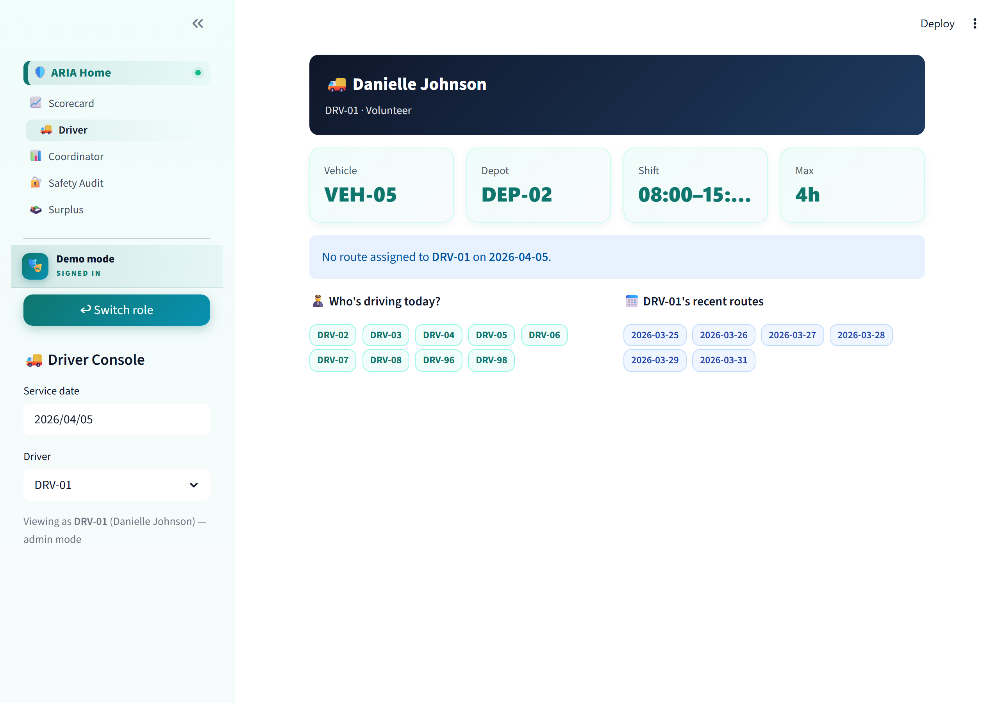
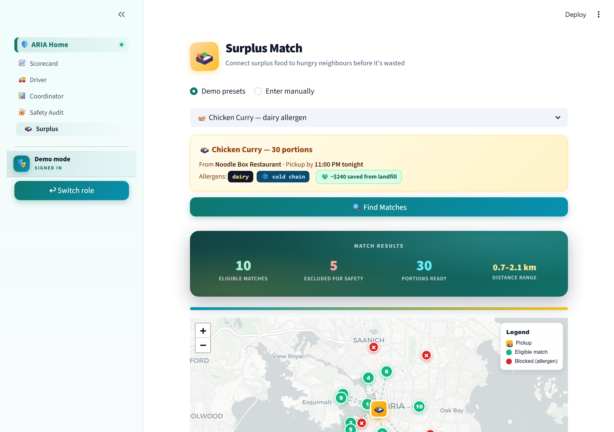
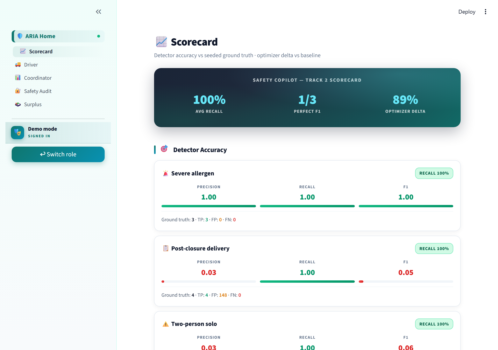
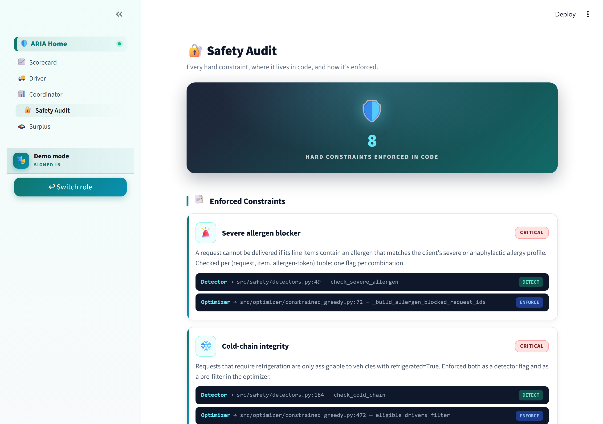

# Screenshots

A walkthrough of every page. For the live version, visit **[aria-safety-copilot.streamlit.app](https://aria-safety-copilot.streamlit.app/)** and pick **🎭 Demo** to see them all.

Regenerate these images with:

```bash
python -m streamlit run app/copilot.py --server.port 8530 --server.headless true
python scripts/capture_screenshots.py --port 8530 --out docs/screenshots
```

---

### Login gate

Five roles. Each scopes the sidebar nav and routes to the relevant primary page.



---

### Hero + Risk Snapshot + streaming briefing

ARIA the animated character reacts to severity. **Risk Snapshot** shows how much of the raw schedule's risk has been cleared — it climbs as fixes are applied, avoiding the alarming "0 / 100" misread. The briefing streams in like Claude, with operator IDs auto-highlighted as code pills.



---

### "The Plan" — before / after panel + flowing route map

Dark hero panel: baseline **5,106** drive-min vs ARIA's **103**. Map shows status-coloured stops, AntPath flowing polylines, pulsing depot halos, and a floating legend.



---

### Anomalies — review and one-click fix

Severity-bordered cards (critical = red pulse, high = orange pulse), staggered slide-in. Each card has an **Apply fix** button that mutates an in-memory overlay; the plan above refreshes automatically.



---

### Coordinator — weekly operations + fleet health

Two tabs: **Weekly Operations** (KPIs, burnout watchlist, fairness gini, scorecard summary) and **Fleet Health** (driver utilization gauges, vehicle capability cards).



---

### Driver — stop clipboard + helpful empty state

Per-driver header card, vehicle / depot / shift metrics. When no route is assigned for the selected date, a helpful nudge shows who *is* driving today and which dates this driver covers — two clicks to un-stick.



---

### Surplus Match

Connect a restaurant's surplus food to eligible neighbours. Three demo presets (dairy / peanut / wheat allergens), folium mini-map, automatic safety blocking, "saved from landfill" impact chip.



---

### Scorecard

Per-detector P / R / F1 with animated progress bars. **Recall = 1.00** across every seeded case. Optimizer delta vs baseline. ARIA vs baseline constraint audit.



---

### Safety Audit

8 hard constraints, each with the `file:line` where it's **detected** and where it's **enforced** — the safety claim is verifiable code, not marketing.


